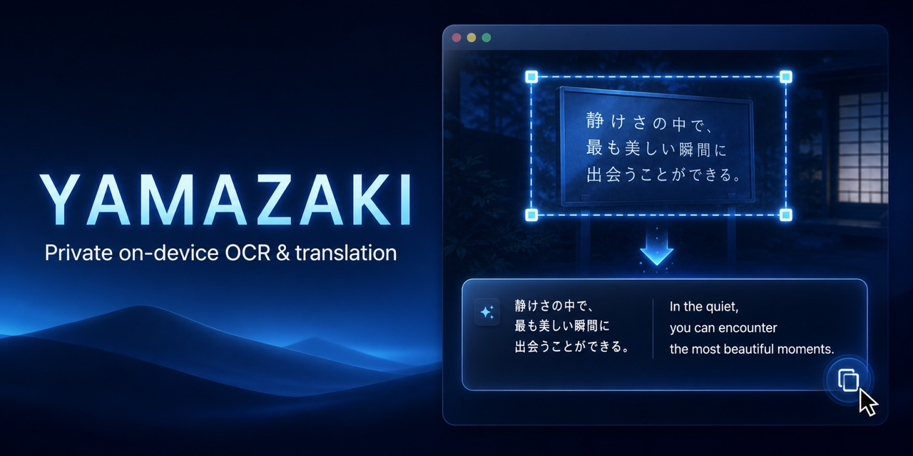
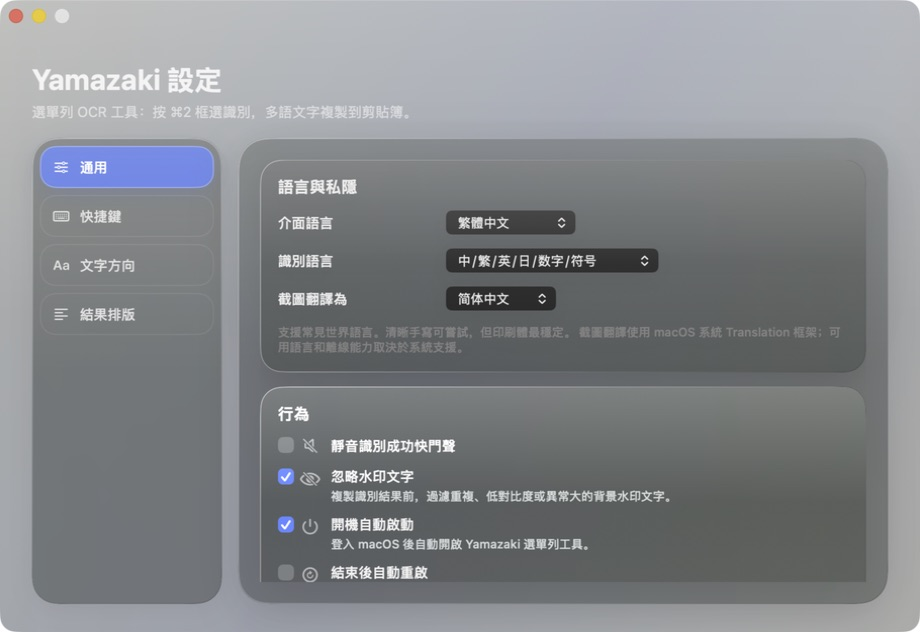

# Yamazaki

<p align="center">
  
</p>

<p align="center">
  <a href="#quick-start"><strong>Quick Start</strong></a> ·
  <a href="https://github.com/Bananainkl/Project_Yamazaki-open-source/releases">Releases</a> ·
  <a href="https://github.com/Bananainkl/Project_Yamazaki-open-source/issues">Issues</a> ·
  <a href="https://github.com/Bananainkl/Project_Yamazaki-open-source/discussions">Discussions</a>
</p>

<p align="center">
  
  
  
  
  
</p>

Yamazaki is a free, local, native macOS menu-bar utility for region OCR and screenshot translation. Select any area of the screen, recognize multilingual text with Apple Vision, and copy the result without sending the image to a custom OCR server.

## Why Yamazaki

- **Fast keyboard workflow**: region capture → OCR or translation → clipboard.
- **Private by design**: OCR runs locally through Apple Vision.
- **Multilingual**: Simplified Chinese, Traditional Chinese, English, Japanese, numbers, and symbols.
- **Truly native**: a lightweight menu-bar app built with Swift, AppKit, and system frameworks.

<p align="center">
  
</p>

Current version: `0.6.8`.

## Features

- Press `Command + E` to select a screen region and copy recognized text
- Press `Command + Shift + E` to translate a selected region
- Recognize Simplified Chinese, Traditional Chinese, English, Japanese, numbers, and symbols
- Choose horizontal or vertical text recognition and smart or line-preserving output
- Filter likely watermark text before copying results
- Customize both global shortcuts with conflict checks
- Start at login or automatically restart the menu-bar utility after an unexpected exit
- Keep OCR local through Apple Vision; translation uses the macOS Translation framework

Yamazaki does not stay in the Dock. Open its settings and commands from the menu-bar icon.

## Requirements

- macOS 13 or later for OCR
- macOS 15 or later for screenshot translation
- Xcode / Swift 5.9 or later for development
- Screen Recording permission for region capture

## Quick Start

```bash
git clone https://github.com/Bananainkl/Project_Yamazaki-open-source.git
cd Project_Yamazaki-open-source
swift build
./script/build_and_run.sh
```

## Build and Run

```bash
swift build
./script/build_and_run.sh
```

Build, install, and launch the fixed app bundle under `/Applications`:

```bash
./script/build_and_run.sh --install
```

Use the installed bundle during permission testing. macOS may associate Screen Recording permission with the bundle path, identity, and code signature, so repeatedly launching temporary builds can cause repeated permission prompts.

## Package a DMG

```bash
./script/package_dmg.sh
```

The local DMG includes Yamazaki and its installation instructions. Snipaste is not bundled; users who want a companion screenshot/annotation app can install it separately from its official website.

Generated app bundles and DMGs are excluded from Git and should be distributed separately from source history.

## Project Layout

```text
Sources/FreeScanOCR/main.swift  # AppKit/SwiftUI app and OCR workflow
Resources/                      # App icon and bundled resources
docs/                           # Public installation guide
script/build_and_run.sh         # Build, bundle, install, and verify
script/package_dmg.sh           # Local DMG packaging
VERSION                         # User-facing application version
```

## Privacy

- OCR uses Apple Vision on the selected image.
- Recognized text is copied through the macOS pasteboard.
- Screen Recording permission is used only to read the region selected by the user; Yamazaki does not record audio or continuously record the screen.
- Screenshot translation behavior and offline availability depend on the macOS Translation framework.

See `docs/INSTALLATION_AND_USAGE.md` for installation, permissions, shortcuts, and troubleshooting.

## Repository Notes

Yamazaki is released under the [MIT License](LICENSE). Third-party products mentioned in the documentation are not part of this repository and retain their own names and licenses.
